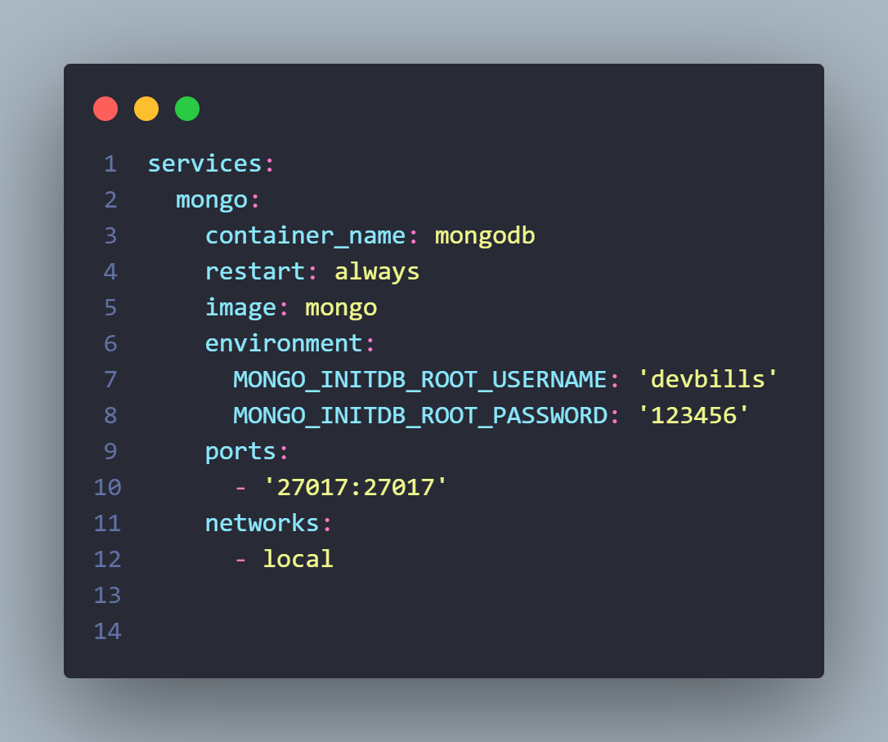
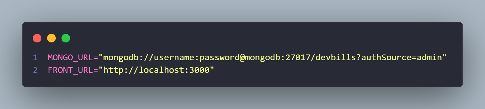
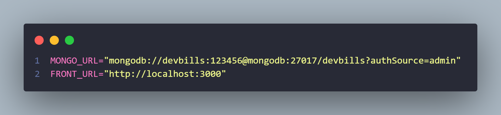

<h1 align="center">API DevBills 💳💰</h1>

API desenvolvida para atender um dashboard financeiro, oferecendo diversas funcionalidades que permitem o usuário gerenciar sua vida financeira
de forma intuitiva e organizada.

## Funcionalidades

- Criar categoria 
- Visualizar categorias
- Criar transações
- Listar transações com filtros
  - por nome
  - por categoria
  - por período ( início e fim )
- Listar dados de saldo com filtro 
  - por período ( início e fim )
- Listar despesas por categorias com filtro
  - por período ( início e fim )
- Listar dados de balanço geral com filtro
  - por ano

## Rotas 

**baseURL** : http://localhost:3333

#### Criar categoria

```bash
  POST /categories
```
 As informações devem ser passadas dentro do corpo(body) da requisição.

| Parâmetros   | Tipo       | Descrição                           |
| :---------- | :--------- | :---------------------------------- |
| `title` | `string` | **Obrigatório**. |
| `color` | `string` | **Obrigatório**.|

#### Retorna todas as categorias

```bash
  GET /categories
```
#### Criar transações

```bash
  POST /transactions
```
 As informações devem ser passadas dentro do corpo(body) da requisição.

| Parâmetros   | Tipo       | Descrição                           |
| :---------- | :--------- | :---------------------------------- |
| `title` | `string` | **Obrigatório**. |
| `amount` | `integer` | **Obrigatório**.|
| `type` | `string` | **Obrigatório**.|
| `date` | `date` | **Obrigatório**.|
| `categoryId` | `string` | **Obrigatório**. O ID da categoria. |

#### Listar transações

```bash
  GET /transactions
```
 As informações devem ser passadas na requisição como query params.

| Parâmetros   | Tipo       | Descrição                           |
| :---------- | :--------- | :---------------------------------- |
| `title` | `string` | **Opcional**. |
| `categoryId` | `string` | **Opcional**. O ID da categoria que deseja.|
| `beginDate` | `date` | **Opcional**.|
| `endDate` | `date` | **Opcional**. |

#### Listar dados de saldo / Listar despesas por categorias

```bash
  GET /transactions/dashboard
```
 As informações devem ser passadas na requisição como query params.

| Parâmetros   | Tipo       | Descrição                           |
| :---------- | :--------- | :---------------------------------- |
| `beginDate` | `date` | **Opcional**.|
| `endDate` | `date` | **Opcional**. |

#### Listar dados de balanço geral

```bash
  GET /transactions/financial-evolution
```
 As informações devem ser passadas na requisição como query params.

| Parâmetros   | Tipo       | Descrição                           |
| :---------- | :--------- | :---------------------------------- |
| `year` | `string` | **Obrigatório**.|

## Rodando localmente

Antes de começar, você precisa ter o Git, Node e Docker instalados.


### Clone o projeto

```bash
  git clone https://github.com/wagnerSfarias/api-devbills.git
```
### Entre no diretório do projeto

```bash
  cd api-devbills
```

### Instale as dependências

```bash
  npm install
```

### Criando containêrs

Nesta aplicação, estou utilizando o banco de dados não relacional do MongoDB para armazenar os dados. Abaixo, estão as instruções sobre como subir o contêiner do banco e também da API.

**Observação**: É necessário estar com o aplicativo do docker aberto na sua maquina, antes de executar os comandos abaixo.

1. Primeiro passo, configurar as variáveis ``` MONGO_INITDB_ROOT_USERNAME ``` e ``` MONGO_INITDB_ROOT_PASSWORD ``` do MongoDB, que estão em um arquivo na raiz do projeto chamado de docker-compose.yml

<br>



<br>

2.  Segundo passo é criar uma arquivo com o nome " .env " na raiz do seu projeto.

Exemplo :

 ```shell
 src/
 .env
 .gitignore
 docker-compose.yml
 ```


  Dentro do arquivo .env, é necessário criar duas variáveis de ambiente, uma que será utilizada para armazenar a URL do MongoDB e a outra para armazenar a URL do seu front-end que será utilizada para configurar o cors. 

 Exemplo:



<br>

**Observação**: Na onde se encontra as palavras ``` username:password ```, devem ser substituítas com os dados  inseridos no [passo 1](#criando-containêrs), conforme exemplo abaixo.   



### Docker compose

```bash
docker-compose up -d --build
```

### Rodando

Pronto !

Agora seus dois containêrs estão rodando e pronto pra ser utilizados !


## Tecnologias utilizadas 👨🏻‍💻

- Node
- TypeScript
- Express
- Mongoose
- ZOD
- Cors
- Docker
- MongoDB
- Status-codes
- Eslint / Prettier